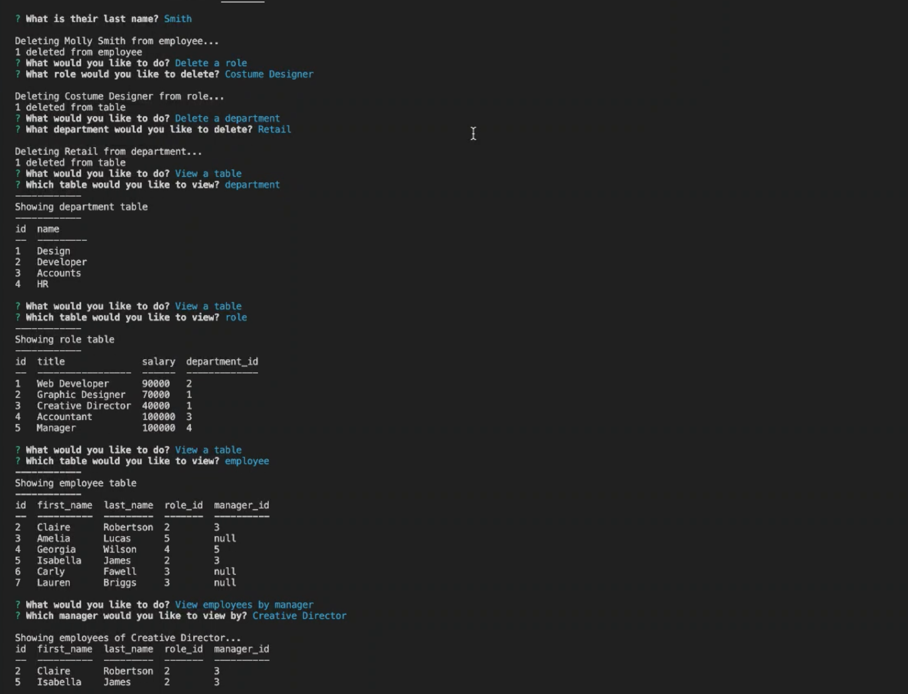

# Unit 12 MySQL Homework: Employee Tracker

A command line application that allows users to view and manage the departments, roles, and employees in their company. So that they can organize and plan their business.

## Functionality Demo

Click on the screenshot below to see the video.

[](https://drive.google.com/file/d/11b-kxcnDmpIx_32YOA6dmp9W_nJJVGvW/view)
[](https://drive.google.com/file/d/1t1DE-WymDG_Hm4TpDaLnQNfpul2JPdkL/view)

## Functionality

A command-line application that at a minimum allows the user to:

  * Add departments, roles, employees

  * View departments, roles, employees

  * Update employee roles

  * View employees by manager

  * Delete departments, roles, and employees

  * View the total utilized budget of a department -- ie the combined salaries of all employees in that department


## User Story

```
As a business owner
I want to be able to view and manage the departments, roles, and employees in my company
So that I can organize and plan my business
```

## Technologies Used

* [MySQL](https://www.npmjs.com/package/mysql) NPM package to connect to the MySQL database and perform queries.

* [InquirerJs](https://www.npmjs.com/package/inquirer/v/0.2.3) NPM package to interact with the user via the command-line.

* [console.table](https://www.npmjs.com/package/console.table) to print MySQL rows to the console.
